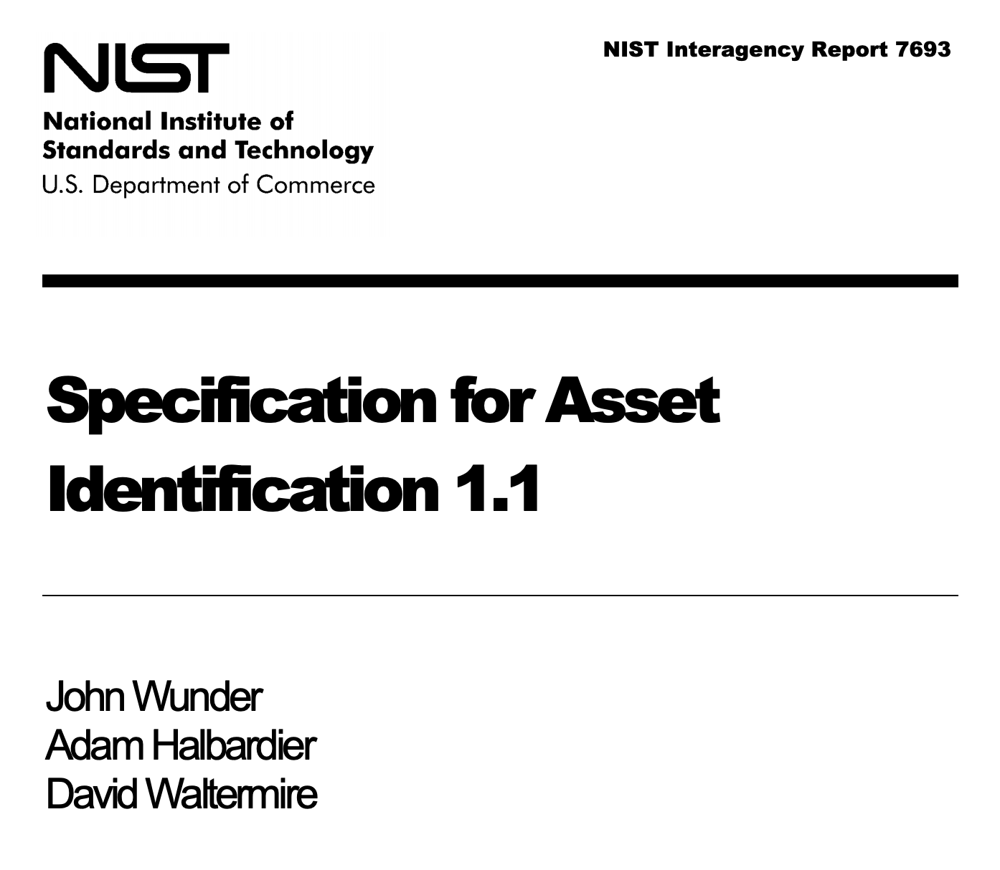
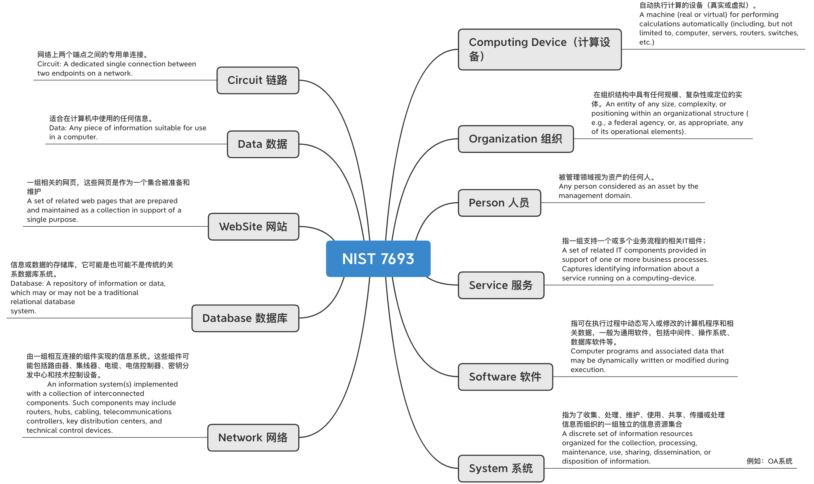
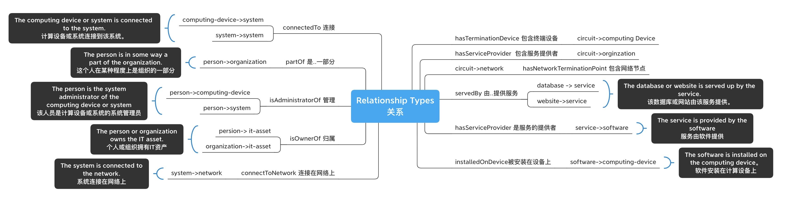
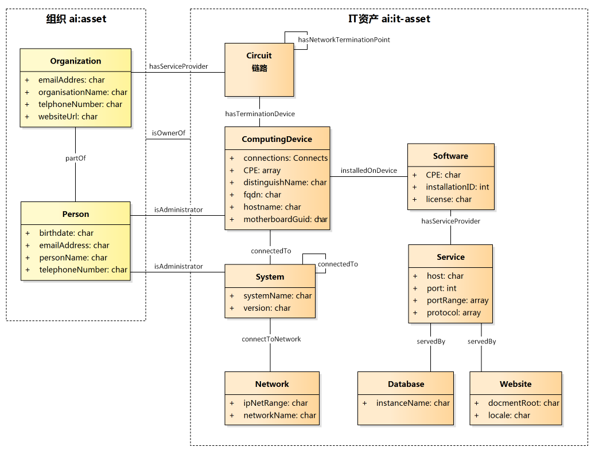
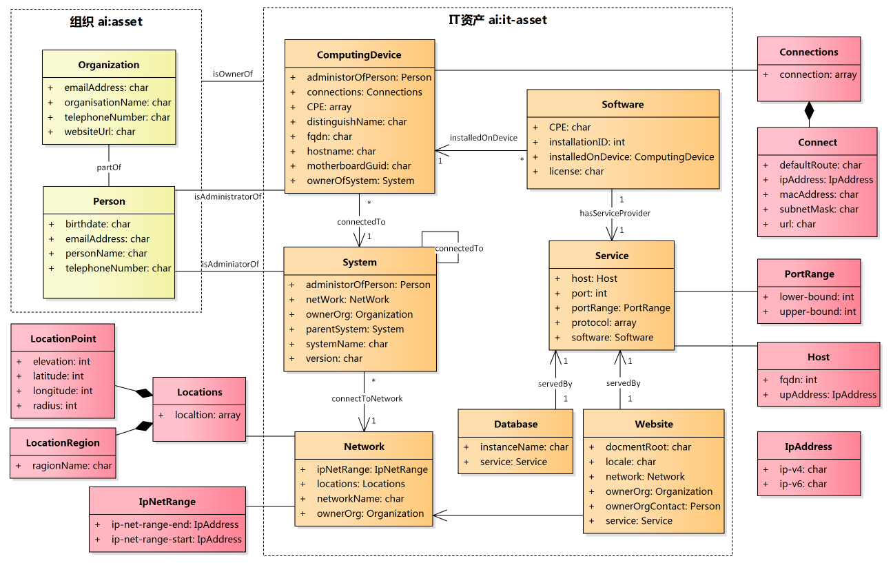

# Asset
Specification for Asset Identification

## NIST 7693
NIST Interagency Report 7693 https://nvlpubs.nist.gov/nistpubs/Legacy/IR/nistir7693.pdf

https://nvlpubs.nist.gov/nistpubs/Legacy/IR/nistir7693.pdf

## 11项资产的定义

## 关系的定义

## NIST标准的资产模型

## 扩展的资产模型类图

